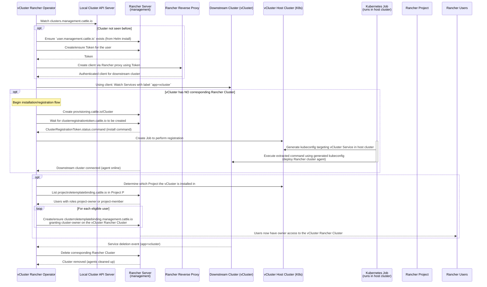

# vcluster-rancher-operator

First class vCluster support in Rancher

## Description

Deploying a vCluster in Rancher should provide the same great experience that provisioning any other cluster in Rancher would. vCluster Rancher Operator automatically integrates vCluster deployments with Rancher. This integration combines the great clusters management of Rancher with the security, cost-effectiveness, and speed of vClusters.

**Features**
* Creates a Rancher Cluster that corresponds to the vCluster.
* Rancher users do not need cluster management permissions. The operator will create the Rancher cluster.
* Project owners and project members of the virtual cluster's project, as well as the cluster owner, will be added to the new Rancher cluster as cluster owners.

**Contents**
- [Installation](#installation)
- [Technical Details](#technical-details)
- [Development](#development)

## Installation
To install vCluster Rancher Operator, you can add the loft repository to Rancher and install the vCluster Rancher Operator chart in the local cluster.
1. Select the local cluster in the Rancher clusters overview page.
2. In the sidebar, navigate to "Apps" -> "Repositories".
3. Select "Create".
4. Set the name to any value and the Index URL to `https://charts.loft.sh`.
5. (Optional) If you want to install pre-release versions you must select the user icon in the top right, then navigate to "Preferences". Scroll down and select "Include Prerelease Versions".
6. In the sidebar, navigate to "Apps" -> "Charts".
7. Find and select the "vCluster Rancher Operator" chart.
8. Follow the installation process and install the chart.
   * 💡 For development with DevSpace, name the installation "app", to match the deployment in `devspace.yaml`.
9. In the sidebar, navigate to "Workloads" -> "Deployments". Confirm that the deployment named "vcluster-rancher-operator" has the State "Active".

Once the operator is installed, all vClusters deployed in any downstream cluster in rancher will cause a corresponding Rancher cluster to be created, the vCluster to connect to the corresponding Rancher cluster, and cluster owners added.

Please note that this plugin is not compatible with the [original vCluster Rancher Integration](https://www.vcluster.com/docs/platform/integrations/rancher/rancher-integration). 

## Uninstall
1. Select the local cluster in the Rancher clusters overview page.
2. In the sidebar, navigate to "Apps" -> "Installed Apps".
3. Delete the vcluster-rancher-operator app. The app will be have the name you gave it during install.

## Technical Details

The vCluster Rancher operator runs in the local cluster and watches `clusters.management.cattle.io`. When a cluster has not been seen by the handler before,
it creates a client using the Rancher reverse proxy to talk to the downstream cluster. This is done by creating a token, if needed, for the `user.management.cattle.io`
that is created during the Helm chart install. The token is then used to authenticate requests to the Rancher proxy.

Once a client is created for a downstream cluster, it is used to watch all services with the label `app=vcluster`. If the vCluster install does not have a corresponding
Rancher cluster, the installation process begins. The installation process creates a provisioning clusters, waits for Rancher to create the `clusterregistrationtoken.cattle.io`,
and then extracts the command from the clusterregistrationtokens status. This command contains everything that is needed to deploy Rancher's cluster agent to the vCluster. A
job is then deployed in the vCluster's host cluster that creates a kubeconfig pointing the the vCluster service in the host cluster. The earlier extracted command is executed
using the newly created kubeconfig.

The service event handler then figures out which project the vCluster is installed in. All Rancher users that have a projectroletemplatebidning.cattle.io for the project with either the
project-owner or project-member roles are added as cluster owners, using a clusterroletemplatebinding.management.cattle.io, to the vCluster Rancher cluster.

Deletion events for the vCluster service will trigger the controller to delete the corresponding Rancher cluster.



## Development

### General Prerequisites
- [Docker](https://www.docker.com/)
- [DevSpace](https://www.devspace.sh/)
- [Rancher](https://ranchermanager.docs.rancher.com/) installed with access to local cluster in rancher.

### To Deploy on the Rancher local cluster

1. Download kubeconfig for rancher's local cluster from rancher, if you do not have direct access. This will be the case for docker installs of rancher.
2. Point the `KUBECONFIG` environment variable to the rancher local cluster's kubeconfig path.
3. Deploy the vCluster Rancher operator using one of the following methods:

**Deploy the manager using devspace**

Note: This is the recommended way to develop on vcluster-rancher-operator

```shell
devspace dev
```

### 💡 Remote debugging
Once devspace has started and opened a shell, the command history will contain a regular `go run` command as well as a `dlv` ([Delve](https://github.com/go-delve/delve))
debugger command set to listen on port `2345`.  To be able to use remote debugging you'll need to be able to reach that port wherever the operator is running.  For example
if you have a managed Kubernetes cluster in DigitalOcean, you'd just need to create a [LoadBalancer](https://kubernetes.io/docs/concepts/services-networking/service/#loadbalancer)
Service with a ports section like

```yaml
spec:
  ports:
  - name: whatever-name-youd-like 
    port: 2345 
    protocol: TCP
    targetPort: 2345 
  selector:
    control-plane: vcluster-rancher-operator # label set in manager.yaml for the Deployment 
  sessionAffinity: None
  type: LoadBalancer 
```

**Build and push your image to the location specified by `IMG`:**

```sh
make docker-build docker-push IMG=<some-registry>/vcluster-rancher-operator:tag
```

**Deploy the Manager to the cluster using Helm**

```sh
KUBECONFIG=/path/to/rancher/host-cluster-kubeconfig.yaml helm install chart --generate-name --create-namespace
```

**Deploy the Manager to the cluster with a custom image**

```sh
KUBECONFIG=/path/to/rancher/host-cluster-kubeconfig.yaml helm install chart --generate-name --create-namespace --set image.registry=<REGISTRY> --set image.repository=<REPO/REPO> --set tag=<TAG>
```

### Update RBAC for installed service account
1. Update controller-gen tags in the file `controller/cluster-controller.go`.
2. Run:
```sh
make manifests
```

### To Uninstall
**Delete devspace install:**
```sh
devspace purge
rm -rf .devspace/*
```

**Delete helm install:**

```sh
helm delete <release-name>
```

## License

Copyright 2025.

Licensed under the Apache License, Version 2.0 (the "License");
you may not use this file except in compliance with the License.
You may obtain a copy of the License at

    http://www.apache.org/licenses/LICENSE-2.0

Unless required by applicable law or agreed to in writing, software
distributed under the License is distributed on an "AS IS" BASIS,
WITHOUT WARRANTIES OR CONDITIONS OF ANY KIND, either express or implied.
See the License for the specific language governing permissions and
limitations under the License.
